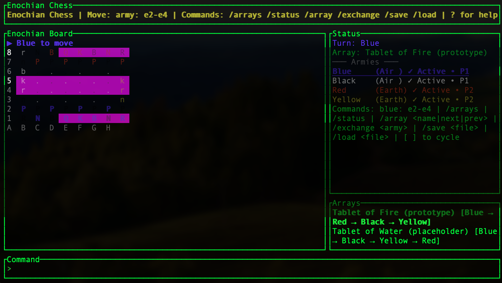

# enoch - an Enochian Chess Engine

A complete implementation of Enochian Chess (also known as Rosicrucian Chess), the four-handed chess variant developed by the Hermetic Order of the Golden Dawn in the late 1800s.

## About Enochian Chess

Enochian chess' fascinating history begins in the late 1800s, when occultists Wynn Westcott and MacGregor Mathers updated the Enochian system of magic for the Hermetic Order of the Golden Dawn. They incorporated a four-handed chess game originally dubbed Rosicrucian chess—later dubbed Enochian chess, due to its derivation from the Enochian Tablets of Dr. John Dee.

The game is based on the ancient Indian game Chaturanga, adapted for four players with unique piece movements and special rules that reflect the esoteric symbolism of the Golden Dawn tradition.

## Features

### Game Rules
- **Four-Army Gameplay**: Blue, Black, Red, and Yellow armies on an 8×8 board
- **Team-Based Victory**: Air team (Blue + Black) vs Earth team (Red + Yellow)
- **Unique Piece Movements**:
  - Queens leap exactly 2 squares (Alibaba-style)
  - Bishops and Queens use different diagonal systems (Aries/Cancer)
  - Special capture restrictions between Queens and Bishops
- **Advanced Mechanics**:
  - King capture (no checkmate - kings are captured like other pieces)
  - Frozen armies when king is captured
  - Throne square control and army revival
  - Privileged pawn promotion rules
  - Stalemate with turn skipping
- **Multiple Starting Arrays**: Eight different board configurations from the Zalewski text

### User Interface
- **Terminal UI**: Full-featured TUI with color-coded armies and visual indicators
- **Colorblind Mode**: Army symbols for accessibility
- **Move Highlighting**: Visual feedback for selected pieces and legal moves
- **Captured Pieces Display**: Track all captures by army
- **Last Move Indicator**: See opponent's previous move
- **Built-in Help System**: Comprehensive in-game reference guide

### AI & Automation
- **AI Opponent**: Single-player mode with capture-preferring strategy
- **Auto-Play**: Watch AI vs AI games
- **Headless Mode**: Non-interactive CLI for scripting and automation

### Engine Tools
- **Move Validation**: Check move legality without applying (`--validate`)
- **Position Analysis**: Inspect squares and legal moves (`--analyze`)
- **Rules Lookup**: Query game rules interactively (`--query`)
- **Custom Positions**: Generate positions from notation (`--generate`)
- **Performance Testing**: Benchmark with perft (`--perft`)
- **Format Conversion**: Transform between JSON, ASCII, and compact formats (`--convert`)
- **Save/Load Games**: JSON-based game state persistence

## Installation

```bash
cargo build --release
```

## Usage

```bash
# Start the game
cargo run --release

# Show help
cargo run --release -- --help
```

### In-Game Commands

- **Move**: `blue: e2-e4` or `blue: e2xe4` (with capture)
- **Promote**: `blue: e7-e8=Q`
- **Help**: Press `?` or `F1` for full rules and command reference
- **Arrays**: `/arrays` to list, `/array <name>` to load
- **Status**: `/status` for game state
- **Save/Load**: `/save <file>` and `/load <file>`
- **Cycle Arrays**: `[` and `]` keys
- **AI Control**: `/ai <army>` to enable AI for an army
- **Colorblind Mode**: `/colorblind` to toggle army symbols

### CLI Tools (Headless Mode)

The engine can be used non-interactively for analysis, testing, and automation:

```bash
# Validate a move without applying it
enoch --headless --validate "blue: e2-e3"

# Analyze a square (show piece info and legal moves)
enoch --headless --analyze e2

# Query rules
enoch --headless --query "can queen capture queen"
enoch --headless --query "promotion"

# Generate custom positions
enoch --headless --generate "Ke1,Qd1:blue Ke8:red" --show
enoch --headless --generate "Ke1:blue Ke8:red" --state position.json

# Performance testing (count positions at depth N)
enoch --headless --perft 4

# Convert between formats
enoch --headless --convert ascii
enoch --headless --convert compact
enoch --headless --convert json
enoch --headless --state game.json --convert compact

# Make moves and save state
enoch --headless --move "blue: e2-e3" --state game.json --show

# AI play
enoch --headless --ai blue,red --auto-play
enoch --headless --state game.json --ai blue --move "blue: e2-e3"

# Query game status
enoch --headless --state game.json --status
enoch --headless --state game.json --legal-moves blue
```

## Game Rules Summary

### Basic Rules

- 8×8 board with four armies (Blue, Black, Red, Yellow)
- Teams: Air (Blue + Black) vs Earth (Red + Yellow)
- Turn order: Blue → Red → Black → Yellow (default array)
- Goal: Capture enemy kings to freeze their armies and achieve team victory

### Piece Movements

- **King**: 1 square in any direction
- **Queen**: Leaps exactly 2 squares (orthogonal or diagonal), ignoring intervening pieces
- **Rook**: Slides any distance orthogonally
- **Bishop**: Slides any distance diagonally
- **Knight**: L-shape (2+1 squares)
- **Pawn**: 1 square forward, captures diagonally (no double-step, no en passant)

### Special Rules

- **Queens cannot capture Queens**
- **Bishops cannot capture Bishops**
- Queens can capture Bishops, Bishops can capture Queens
- Bishops and Queens use different diagonal systems (Aries vs Cancer)

### Check & Capture

- No checkmate—kings are **captured**
- If in check with legal king moves: **must** move king
- Captured king = army becomes **frozen** (cannot move/attack)
- Frozen pieces act as blocking terrain

### Throne Squares

- Each army has a throne square (king's starting position)
- Moving your king onto ally's throne = gain control of that army
- Frozen pieces revive when you control their throne

### Promotion

- Blue pawns promote on rank 8 (north)
- Red pawns promote on rank 1 (south)
- Black pawns promote on file h (east)
- Yellow pawns promote on file a (west)
- **Privileged pawn**: With only K+Q+P, K+B+P, or K+P, pawn can promote to any piece

## Development

### Running Tests

```bash
cargo test
```

Current test coverage: 54 tests (29 game tests + 8 UI tests + 17 integration tests) covering move generation, game rules, serialization, and complete game scenarios.

### Project Structure

```
src/
├── engine/          # Core game logic
│   ├── arrays.rs    # Starting array configurations
│   ├── board.rs     # Board representation and bitboards
│   ├── game.rs      # Game state and move application
│   ├── moves.rs     # Move generation
│   ├── types.rs     # Core types (Army, Piece, etc.)
│   ├── piece_kind.rs # Piece-specific logic
│   └── ai.rs        # AI strategies
├── ui/              # Terminal UI
│   ├── app.rs       # Application state
│   └── ui.rs        # Rendering
└── main.rs          # Entry point and CLI

docs/
├── enochian-rules.md      # Complete rules specification
├── enochian-arrays.md     # Starting array descriptions
├── enochian-rules.yaml    # Machine-readable rules
└── architecture.md        # Technical architecture

tests/
├── enoch_moves.rs         # Move generation tests
├── enoch_rules.rs         # Game rule tests
├── enoch_serialization.rs # Save/load tests
├── integration.rs         # End-to-end game tests
└── ui_rendering.rs        # UI rendering tests
```

## References

- Zalewski, Chris. *Enochian Chess of the Golden Dawn*. Llewellyn Publications, 1994.
- Regardie, Israel. *The Golden Dawn*. Llewellyn Publications, 1937-1940.
- Murray, H.J.R. *A History of Chess*. Oxford University Press, 1913.

## License

See LICENSE file.

## Acknowledgments

This implementation is based on the comprehensive rules documentation by Chris Zalewski, who spent 14 years researching and codifying the Enochian chess system for practical play. The game's origins trace back to the Hermetic Order of the Golden Dawn and ultimately to the ancient Indian game of Chaturanga.

